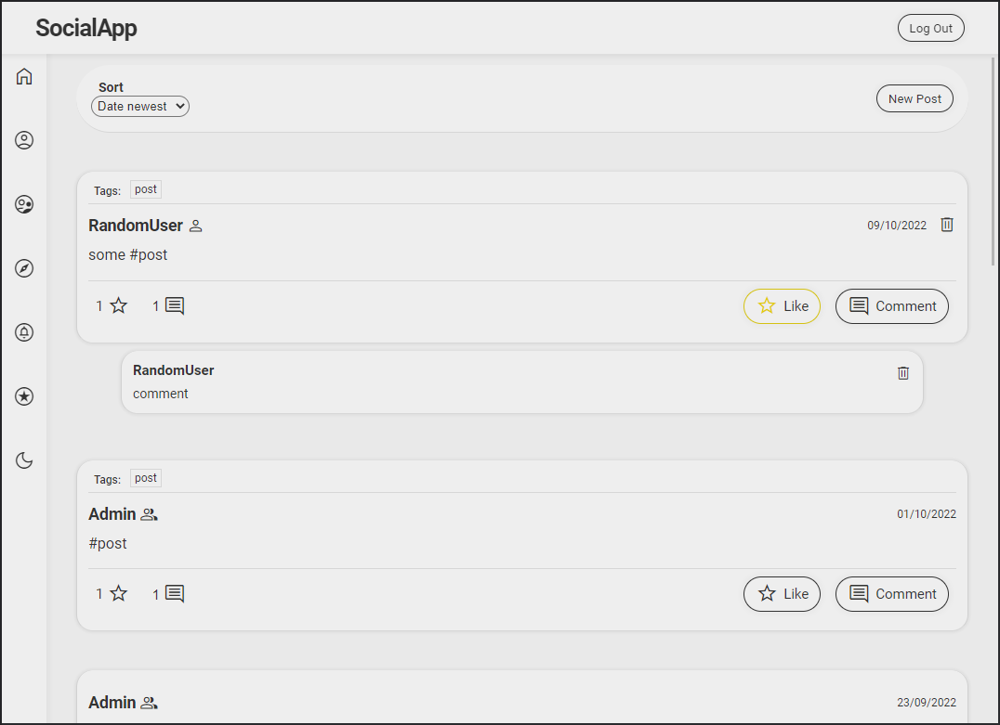

# Social App

Single page application made with ReactJS for UI and Firebase for backend.
Users can add new posts and attach tags to them with "#" symbol, delete own posts,
add comments and likes to post and add other users as friend.
Application have 2 themes to switch between (light mode and dark mode).
There are few subpages like:

- Homepage - main page with all posts,
- Profile - user profile, where are visible posts which user is author,
- Friends - friends list from where user can remove friend or visit friend profile,
- Explore - subpage where user can see existing tags and filtr posts with them,
- Notifications - list of activity which relate to user,
- Liked - posts which user liked.

## Demo

### Sample account
- mail: randomuser@mail.com
- username: RandomUser
- password: RandomUser
- or create new one with registration panel.

